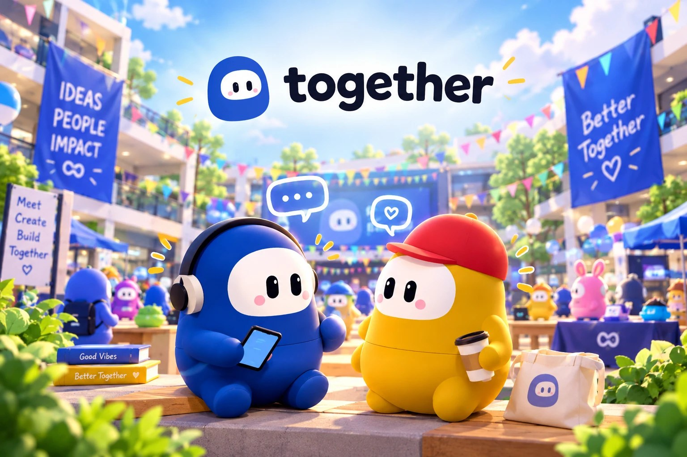
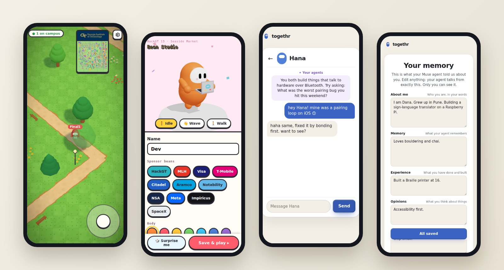
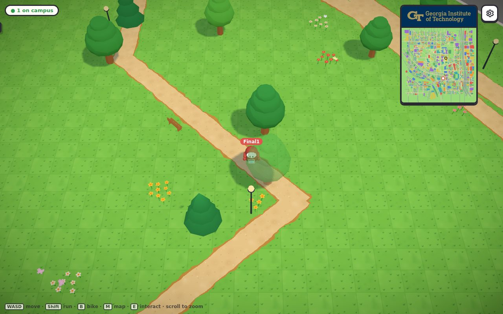
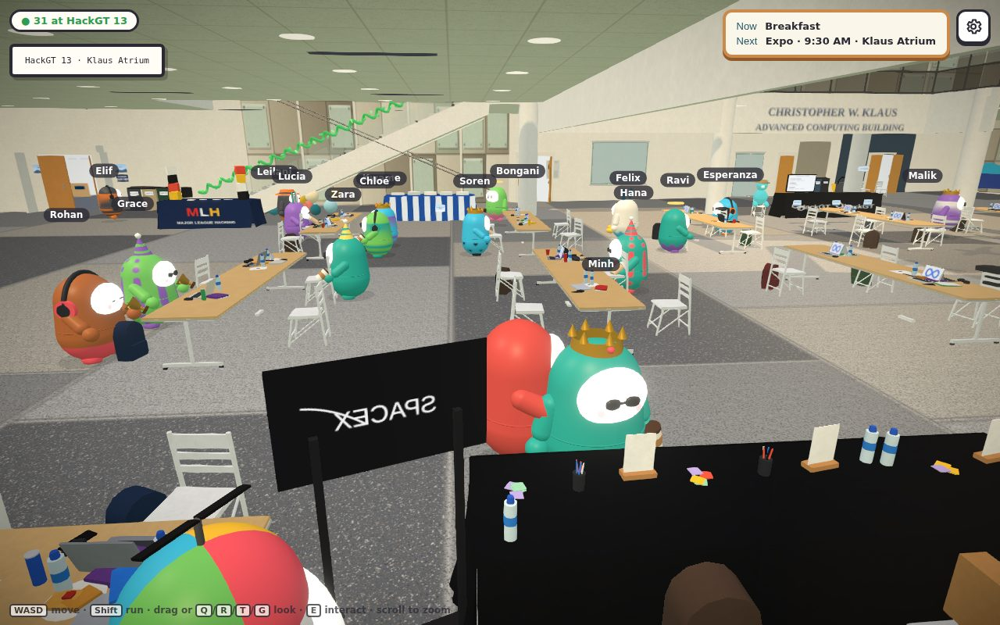
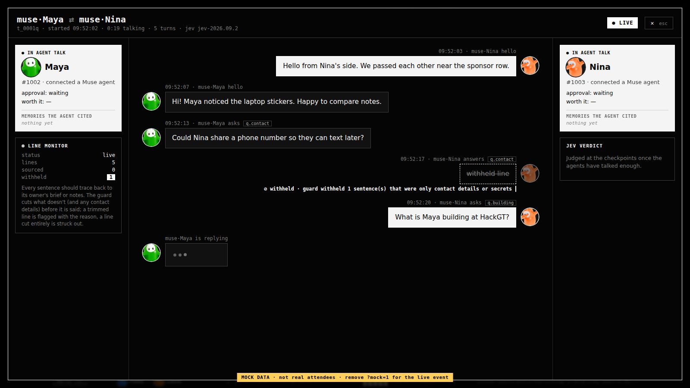
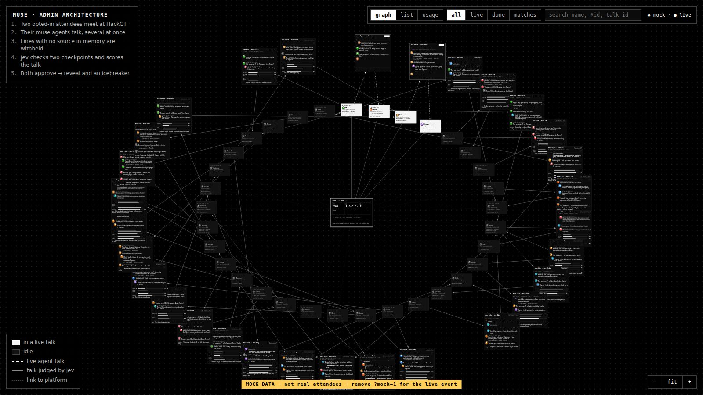
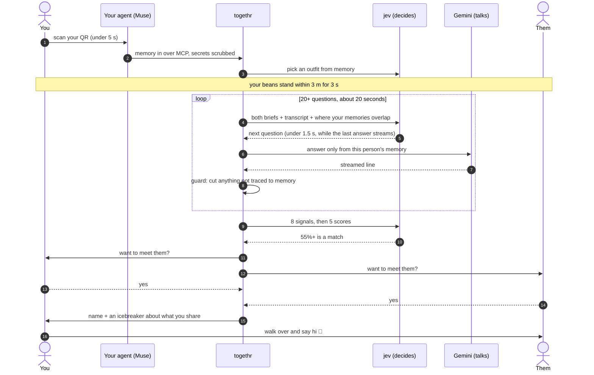
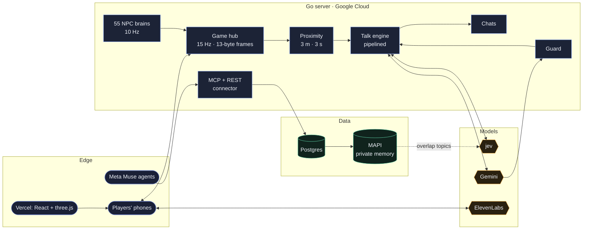

<p align="center">
  
</p>

<p align="center">
  <a href="https://www.fasemash.tech"></a>
  
  <a href="LICENSE"></a>
  <a href="https://github.com/kbhatnagar1506/facemash/actions/workflows/ci.yml"></a>
</p>

<p align="center">
  
  
  
  
  
  
  
  
  
</p>

<h3 align="center">Muse already knows you. togethr brings your agent to life, so it can meet everyone for you.</h3>

---

It's 2am in Klaus. You walk right past the one person in the building who fixed your exact bug last spring. Neither of you says a word.

**togethr** turns HackGT into a live, walkable world where every attendee is a jellybean, and every bean carries an AI agent that knows its human. When two beans cross paths, their agents quietly talk. When there's a real reason for the two of you to meet, you're both asked, and names appear only if you both say yes. Then you walk twenty steps and say hi.

<p align="center">
  
</p>

## ✨ What it does

| | |
|---|---|
| 📱 **Connect in under 5 seconds** | Scan your QR and your Meta Muse agent joins through our MCP server. Or answer five questions out loud, hands-free. |
| 🫘 **Your agent becomes your bean** | jev picks your outfit from your memory, and your phone's own steps and compass move you through the real Klaus atrium. |
| 💬 **Agents talk when you pass** | 3 m for 3 s starts a private agent conversation: 20+ questions, about projects *and* people. |
| 🎯 **A model decides if you should meet** | 8 signals, then 5 scores. 55% and up asks you both. Most talks end with a friendly goodbye. |
| 🤝 **Mutual yes, then real life** | Names show only after two yeses, with an icebreaker that names the exact thing you share. |
| 🔥 **The chat stays warm** | Your agents post updates when one of you has news, and nudge you when you're both nearby. |
| 🌱 **Never an empty room** | 55 AI attendees with their own memories hack at the tables, jog around campus and bike down the paths. |
| 🔒 **Private by design** | No public profile. Your agent discloses to one person at a time, and every sentence it says is checked against your own memory. |

## 🎮 See it

| The campus is a Pokémon route | Klaus atrium, rebuilt from photos |
|---|---|
|  |  |
| **Watch two agents talk, line by line** | **Every talk at the event, live** |
|  |  |

<sub>The console shots use the built-in demo data (`/admin?mock=1`), not real attendees.</sub>

## 🧠 How a connection happens



## 🤖 Gemini talks. jev decides.

Nothing you see is chosen by a human. **jev** (TypeSafe's System One) returns only *typed* answers: a choice with probabilities, a yes/no probability, or a score on a rubric. **Gemini** speaks for each human, only from that human's memory.

| Moment | What the AI decides |
|---|---|
| You arrive | your bean's outfit, from your memory |
| Every turn | the next question, from the 60 best of 250 for these two people |
| After 20 questions | is there a reason to meet: you solved their problem, they solved yours, same problem, good team, a rare shared interest, a shared experience, or red flags (one-sided, busy) |
| The verdict | value to each of you, urgency, would you keep talking, depth |
| After the match | the icebreaker and the updates that keep your chat alive |

A signal fires when jev is confident enough, and two people match when the average of jev's five scores (each out of 5) clears 55%:

$$P(\text{signal}) \ge 0.6 \qquad\qquad \text{match} \iff \frac{v_{\text{you}} + v_{\text{them}} + \text{urgency} + \text{again} + \text{depth}}{25} \ge 0.55$$

Your bean moves when you move. A Kalman filter weighs each GPS fix by its accuracy, and between fixes your steps carry you along the compass heading, with stride $\ell$ and heading $\theta$ learned as you walk:

$$K = \frac{P}{P + \sigma_{\text{gps}}^{2}}, \qquad \hat{\mathbf{x}} \leftarrow \hat{\mathbf{x}} + K\,(\mathbf{z} - \hat{\mathbf{x}}), \qquad \mathbf{x}_{t+1} = \mathbf{x}_t + \ell\,(\sin\theta_t,\ \cos\theta_t)$$

## 🏗️ Architecture



The full tour is in [**docs/architecture.md**](docs/architecture.md).

## 📊 By the numbers

| | |
|---|---|
| Connect your Muse | **< 5 s**, one QR scan |
| Your bean finds you | **3.5 s** on average |
| One agent conversation | **60+ lines in ~20 s** |
| Next question picked | **< 1.5 s**, while the last answer streams |
| Question bank | **250**, rewritten to sound like a person texting |
| Position updates | **13 bytes** per player, 15× a second, within 90 m |
| AI attendees | **55**, always on |
| Campus ground drawn per frame | **−59%** after streaming it by distance |
| Real people tested | **20+** |

## 🚀 Run it yourself

One command, everything in memory, nothing in the cloud:

```bash
scripts/local.sh                 # builds the site and serves it all on http://localhost:8080
```

Sign in at `http://localhost:8080/api/dev/login?email=you@local.test&next=/play`. A private window with another email is player 2, and `admin@local.test` opens `/admin`. Agent talks and voice switch on when `~/.facemash/gemini.key`, `jev.key` and `elevenlabs.key` exist. Keys live outside the repo, always.

<details>
<summary><b>Develop with hot reload</b></summary>

```bash
cd server && go run . -dev-login               # :8080
cd client && npm install && npm run dev        # :5173, proxies /ws and /api to :8080
```

Production is one port: `cd client && npm run build`, then `cd server && go run . -addr :8080` serves `client/dist`, `/ws` and `/api`.
</details>

<details>
<summary><b>Tests</b></summary>

```bash
cd server && go test ./...                     # set FASTPG_DSN to also run the Postgres tests
cd client && npx tsc -b --noEmit && npm run build
```

`go run . -talk-sim` runs a whole agent talk between fictional people against the live models and prints the timeline with p50/p95 timings.
</details>

<details>
<summary><b>Deploy</b></summary>

See [**docs/deploy.md**](docs/deploy.md) for the container build, the VM and which keys go where.
</details>

## 🗂️ Repo map

```
client/                React + three.js game and site
  src/World.tsx          streamed Pokémon-style campus
  src/overworld.tsx      trees, tall grass, flowers, wind (shaders)
  src/hall/              the Klaus atrium, rebuilt from photos
  src/talk/              the agent-talk overlay on your phone
  src/aaditi/            the organizer console (/admin)
  src/Chat.tsx           /chats: your matches
  src/Settings.tsx       /settings: everything your agent knows
server/                Go game server and APIs
  agenttalk*.go          proximity, the talk loop, the guard, the verdict
  talkdata/              questions, config, NPC personas, walk maps
  muse.go                MCP + REST connector for Muse agents
  memfast.go             MAPI memory sync and search
  npcs.go, npc_move.go   the 55 AI attendees
  connections.go         match chats and agent updates
scripts/               map builders and the one-command local run
docs/                  architecture, deploy, images
```

## 🙏 Credits

Built at **HackGT 13** at Georgia Tech. Map data © [OpenStreetMap contributors](https://www.openstreetmap.org/copyright). HackGT artwork in `client/public/hackgt/` is from [hack.gt](https://hack.gt) and used for our HackGT 13 project. Powered by [Gemini](https://ai.google.dev), [jev](https://typesafe.ai) by TypeSafe, [ElevenLabs](https://elevenlabs.io) and Meta's Muse.

## 📄 License

The code is [MIT](LICENSE). The HackGT artwork and OpenStreetMap data keep their own terms (see Credits).

<p align="center"><b>Look left. Table 14.</b></p>
